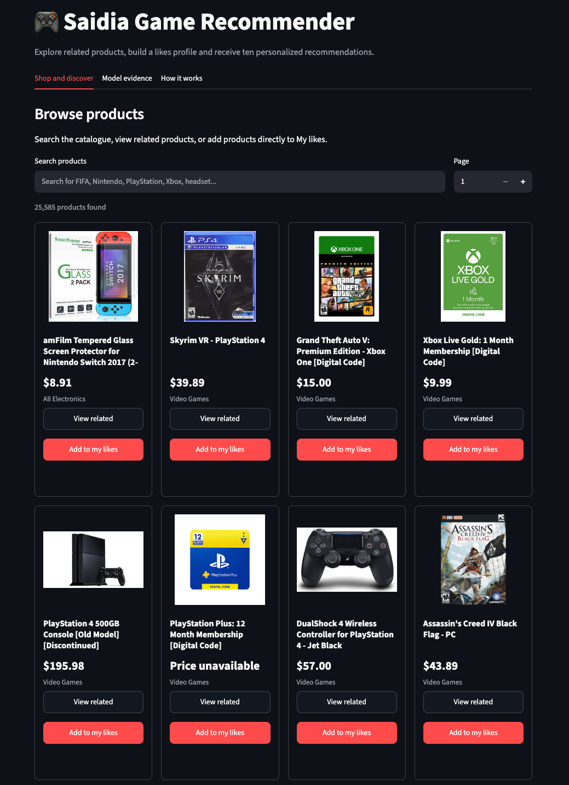
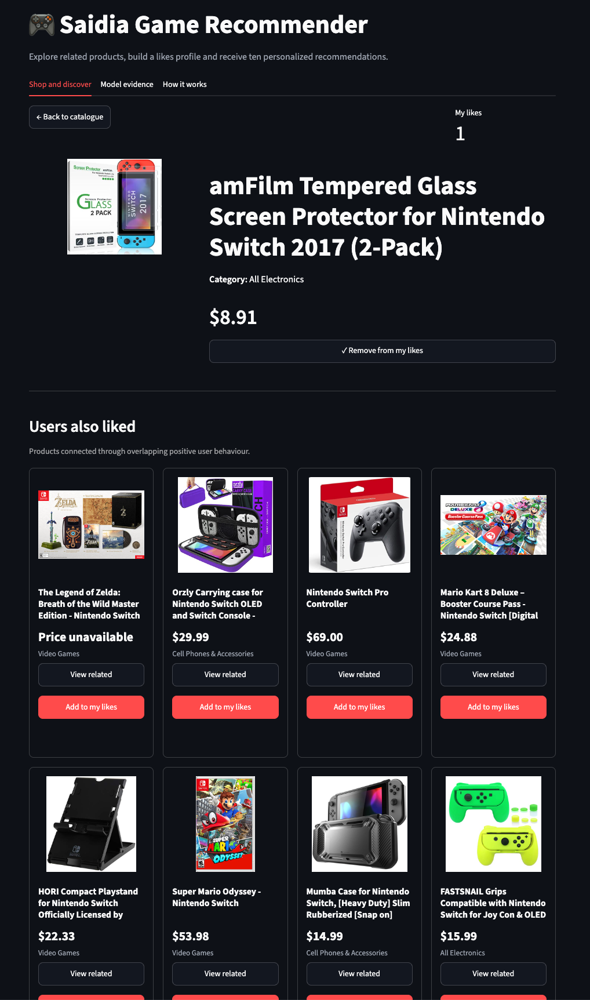
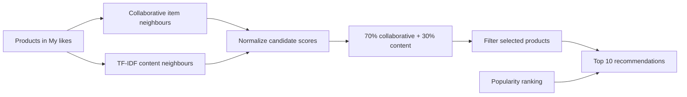
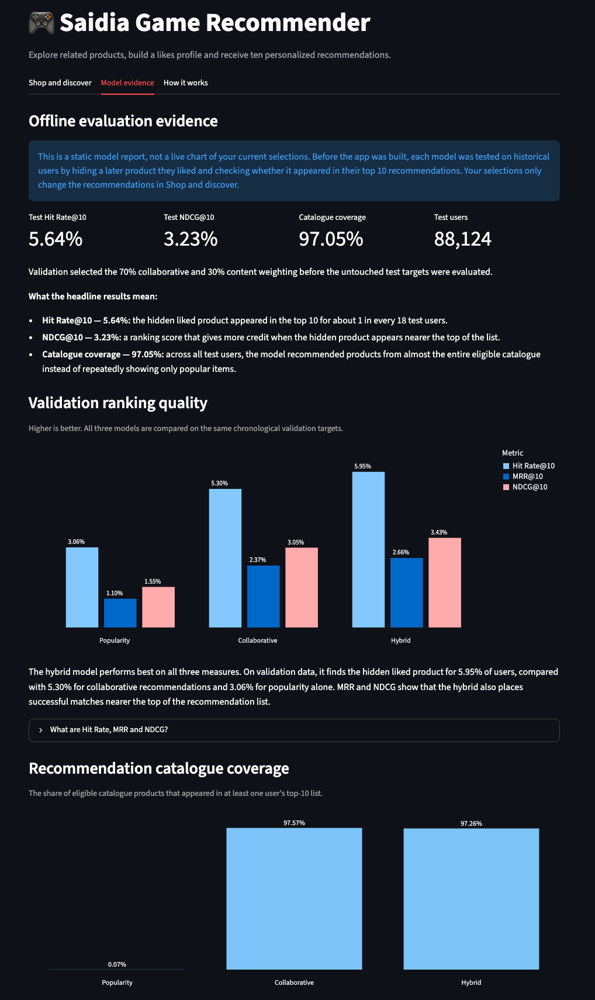

# Saidia Game Recommender

An explainable hybrid recommender built from the Amazon Reviews 2023 Video Games dataset. Saidia lets visitors browse a product catalogue, explore behavioural and content-based neighbours, build a temporary likes profile, and receive ten personalized recommendations.

The project combines collaborative item similarity, TF-IDF product similarity, and a popularity fallback. Model selection uses chronological validation data, while final performance is reported on a later untouched test interaction for each eligible user.



## What the application does

- Searches and browses a catalogue of 25,585 products.
- Shows **Users also liked** recommendations based on overlapping positive behaviour.
- Shows **Similar products** based on titles, categories, descriptions, and features.
- Lets visitors add and remove products from a temporary likes profile.
- Produces ten personalized hybrid recommendations.
- Displays offline evaluation evidence and documented limitations inside the application.



## Recommendation design



The selected hybrid weighting is:

- **70% collaborative evidence:** products connected through overlapping positive user behaviour.
- **30% content evidence:** products with similar metadata.
- **Popularity fallback:** fills any remaining recommendation positions when neighbour evidence is insufficient.

The weighting was selected using validation NDCG@10 rather than chosen manually.

## Data preparation and leakage prevention

The project uses the [Amazon Reviews 2023](https://amazon-reviews-2023.github.io/) Video Games review and metadata files.

- Ratings of 4 or 5 are treated as positive interactions.
- Eligible evaluation users require at least three distinct positive-interaction times.
- The second-newest positive interaction is held out for validation.
- The newest positive interaction is held out for final testing.
- Earlier positive interactions form development training data.
- After model selection, validation interactions return to the final training data.
- Chronological assertions verify that training interactions occur before each user's target.
- Thirteen users with ambiguous target timestamps are excluded from primary scoring.

This user-level chronological split better represents recommending a later product from earlier history than a random interaction split.

## Offline evaluation

The validation set selects the model configuration. The final test set is evaluated only after the 70/30 weighting has been chosen.

| Model | Split | Hit Rate@10 | MRR@10 | NDCG@10 | Catalogue coverage |
|---|---|---:|---:|---:|---:|
| Popularity baseline | Validation | 3.07% | 1.10% | 1.55% | 0.07% |
| Collaborative + popularity fallback | Validation | 5.30% | 2.37% | 3.05% | 97.57% |
| Hybrid 70/30 | Validation | **5.95%** | **2.66%** | **3.43%** | 97.26% |
| Hybrid 70/30 | Test | **5.64%** | **2.50%** | **3.23%** | **97.05%** |

The final test evaluates 88,124 users. A 5.64% Hit Rate@10 means the hidden later product appeared in the ten recommendations for approximately one in every eighteen test users. Catalogue coverage measures the variety of products recommended across all evaluated users, not the number shown to one user.



## Repository structure

```text
.
├── app.py
├── data/
│   ├── raw/                         # excluded from Git
│   └── processed/                   # excluded from Git
├── docs/
│   └── screenshots/
├── models/
│   ├── hybrid_recommender.joblib
│   └── product_catalogue.csv.gz
├── notebooks/
│   ├── 01_data_validation.ipynb
│   ├── 02_exploratory_data_analysis.ipynb
│   ├── 03_data_preparation.ipynb
│   └── 04_recommender_modelling.ipynb
├── reports/
│   ├── final_test_metrics.csv
│   ├── hybrid_validation_results.csv
│   └── model_comparison.csv
└── requirements.txt
```

The trained model and application catalogue are committed so the Streamlit application can run without access to the raw review files or notebook state.

## Run locally

Python 3.12 was used during development.

```bash
git clone https://github.com/Begge10850/saidia-recommender.git
cd saidia-recommender
python3 -m venv .venv
source .venv/bin/activate
python -m pip install -r requirements.txt
streamlit run app.py
```

Then open the local address printed by Streamlit, normally `http://localhost:8501`.

## Technology

- Python
- pandas and NumPy
- SciPy sparse matrices
- scikit-learn TF-IDF and cosine similarity
- joblib model serialization
- Streamlit and Altair
- Jupyter notebooks

## Known limitations

- The results are from offline ranking evaluation and do not establish conversion, revenue impact, or real-user satisfaction.
- Ratings indicate expressed feedback, not verified purchases or shopping baskets.
- Ratings from 1 to 3 are retained during preparation but are not modeled as explicit negative preferences.
- Missing interactions are unknown rather than dislikes.
- Product metadata includes some noisy category assignments.
- Metadata is treated as a catalogue snapshot rather than reconstructed at every historical interaction time.
- The application uses a temporary session profile and does not provide authentication or persistent user accounts.

## Supporting artifacts

- [Final test metrics](reports/final_test_metrics.csv)
- [Hybrid weight validation](reports/hybrid_validation_results.csv)
- [Model comparison](reports/model_comparison.csv)
- [Additional application screenshots](docs/screenshots)
